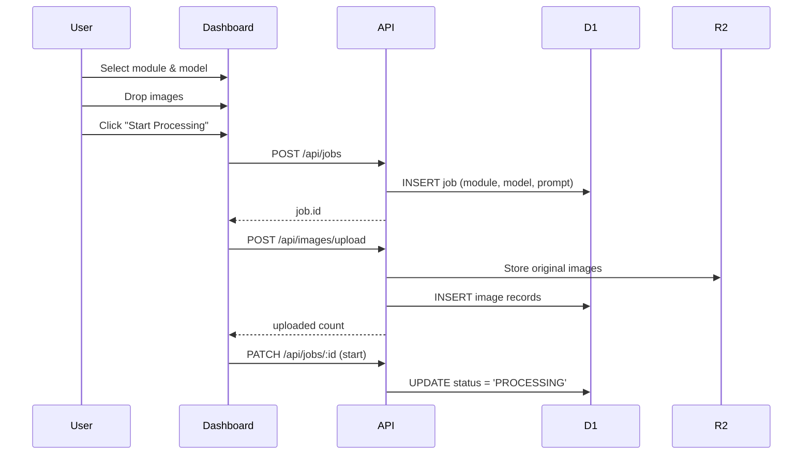
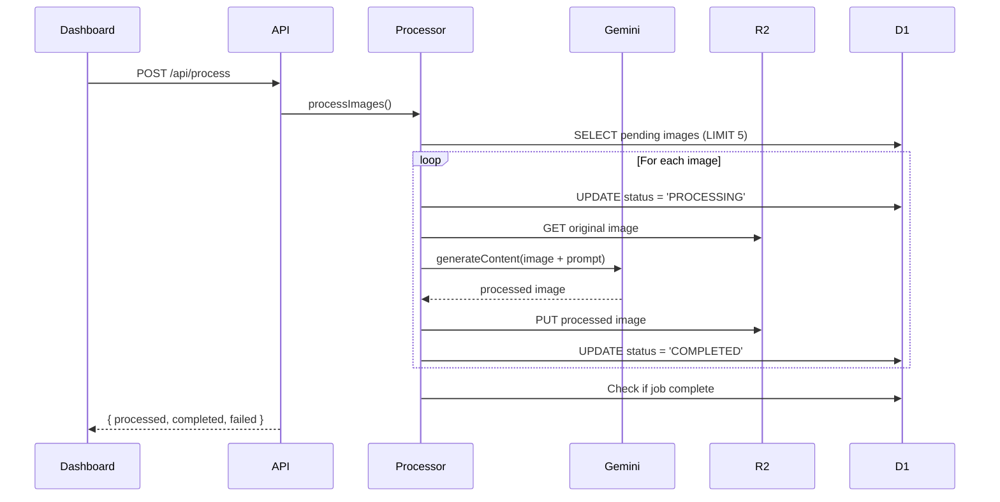
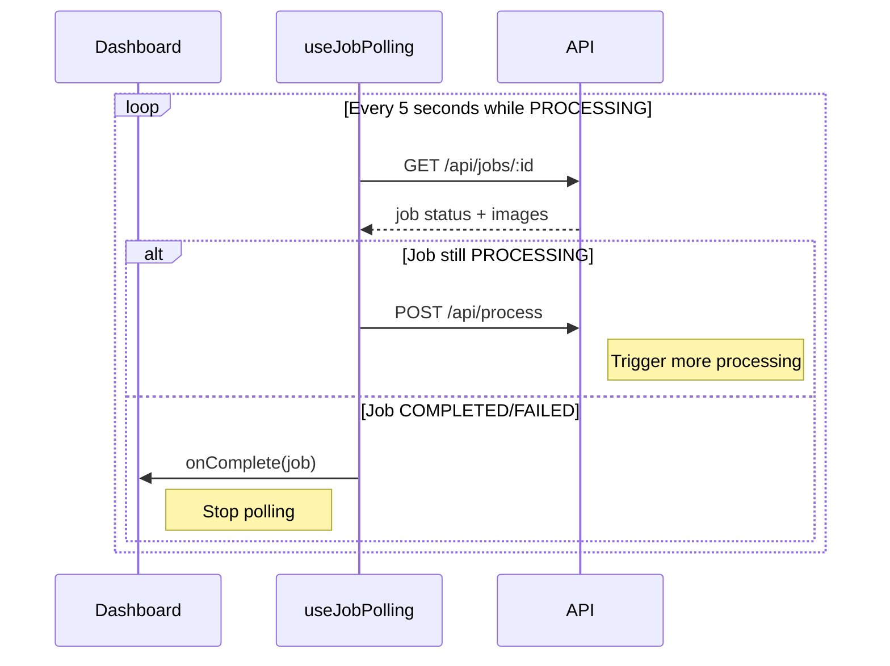

# LightWork - Technical Documentation

> AI-powered batch image processing using Google's Gemini Nano Banana models

## Overview

LightWork is a web application that allows users to batch process images using Google's Gemini AI image generation models. Users can upload multiple images, select an enhancement module, choose between free/fast or paid/pro AI models, and process them all at once.

---

## Architecture

```
┌─────────────────────────────────────────────────────────────────┐
│                        Frontend (React + Vite)                   │
│  ┌──────────┐  ┌──────────┐  ┌──────────┐  ┌──────────────────┐ │
│  │DropZone  │  │Module    │  │Model     │  │CommandCenter     │ │
│  │          │  │Selector  │  │Selector  │  │(Start/Cancel)    │ │
│  └──────────┘  └──────────┘  └──────────┘  └──────────────────┘ │
│                              │                                   │
│                    ┌─────────▼─────────┐                        │
│                    │   Dashboard.tsx   │                        │
│                    │  (Main Controller)│                        │
│                    └─────────┬─────────┘                        │
│                              │                                   │
│                    ┌─────────▼─────────┐                        │
│                    │   src/lib/api.ts  │                        │
│                    │   (API Client)    │                        │
│                    └─────────┬─────────┘                        │
└──────────────────────────────┼──────────────────────────────────┘
                               │ HTTP
┌──────────────────────────────▼──────────────────────────────────┐
│                Cloudflare Pages Functions (Backend)              │
│  ┌────────────┐  ┌────────────┐  ┌────────────┐  ┌───────────┐  │
│  │/api/jobs   │  │/api/images │  │/api/process│  │/api/health│  │
│  └──────┬─────┘  └──────┬─────┘  └──────┬─────┘  └───────────┘  │
│         │               │               │                        │
│         └───────────────┴───────┬───────┘                        │
│                                 │                                │
│                    ┌────────────▼────────────┐                   │
│                    │   lib/processor.ts      │                   │
│                    │   (Processing Engine)   │                   │
│                    └────────────┬────────────┘                   │
│                                 │                                │
│                    ┌────────────▼────────────┐                   │
│                    │   lib/gemini.ts         │                   │
│                    │   (Gemini API Client)   │                   │
│                    └────────────┬────────────┘                   │
└─────────────────────────────────┼───────────────────────────────┘
                                  │
              ┌───────────────────┼───────────────────┐
              ▼                   ▼                   ▼
        ┌──────────┐       ┌──────────┐       ┌──────────┐
        │   D1     │       │   R2     │       │ Gemini   │
        │ Database │       │ Storage  │       │   API    │
        └──────────┘       └──────────┘       └──────────┘
```

---

## Data Flow

### 1. Job Creation & Image Upload



### 2. On-Demand Processing



### 3. Polling Loop



---

## Key Components

### Frontend

| Component | Path | Purpose |
|-----------|------|---------|
| `Dashboard` | `src/pages/Dashboard.tsx` | Main controller, orchestrates the entire flow |
| `DropZone` | `src/components/DropZone.tsx` | Drag-and-drop image upload |
| `ModuleSelector` | `src/components/ModuleSelector.tsx` | Choose enhancement type |
| `ModelSelector` | `src/components/ModelSelector.tsx` | Choose Fast (free) or Pro (paid) |
| `StagingGrid` | `src/components/StagingGrid.tsx` | Preview uploaded images |
| `CommandCenter` | `src/components/CommandCenter.tsx` | Start/Cancel/Download controls |
| `useJobPolling` | `src/hooks/useJobPolling.ts` | Polls job status + triggers processing |

### Backend (Cloudflare Pages Functions)

| Endpoint | Path | Purpose |
|----------|------|---------|
| `GET /api/modules` | `functions/api/modules/index.ts` | List available modules |
| `POST /api/jobs` | `functions/api/jobs/index.ts` | Create new job |
| `GET /api/jobs/:id` | `functions/api/jobs/[id].ts` | Get job status + images |
| `PATCH /api/jobs/:id` | `functions/api/jobs/[id].ts` | Start/Cancel job |
| `POST /api/images/upload` | `functions/api/images/upload.ts` | Upload images to R2 (validates MIME + 10MB limit) |
| `POST /api/process` | `functions/api/process.ts` | Trigger image processing |

### Libraries

| Library | Path | Purpose |
|---------|------|---------|
| `GeminiService` | `functions/lib/gemini.ts` | Gemini API client for image generation |
| `processor` | `functions/lib/processor.ts` | Core processing logic |

---

## Database Schema

### Jobs Table

```sql
CREATE TABLE jobs (
  id TEXT PRIMARY KEY,
  module_id TEXT NOT NULL,
  global_prompt TEXT,
  model TEXT DEFAULT 'nano_banana',  -- 'nano_banana' or 'nano_banana_pro'
  status TEXT DEFAULT 'PENDING',     -- PENDING, PROCESSING, COMPLETED, FAILED, CANCELLED
  total_images INTEGER DEFAULT 0,
  completed_images INTEGER DEFAULT 0,
  failed_images INTEGER DEFAULT 0,
  created_at INTEGER,
  started_at INTEGER,
  completed_at INTEGER
);
```

### Images Table

```sql
CREATE TABLE images (
  id TEXT PRIMARY KEY,
  job_id TEXT NOT NULL,
  original_key TEXT NOT NULL,        -- R2 key for original
  processed_key TEXT,                -- R2 key for processed
  status TEXT DEFAULT 'PENDING',     -- PENDING, PROCESSING, COMPLETED, FAILED, RETRY_LATER
  specific_prompt TEXT,
  error_message TEXT,
  retry_count INTEGER DEFAULT 0,
  mime_type TEXT
);
```

---

## AI Models

| Model | ID | Use Case | Output | Cost |
|-------|-----|----------|--------|------|
| **Nano Banana** | `gemini-2.5-flash-image` | High-volume batch processing | 1024px | Free |
| **Nano Banana Pro** | `gemini-3-pro-image-preview` | Professional quality | Up to 4K | Paid |

### Model Selection Flow

1. User selects model via `ModelSelector` toggle in UI
2. Model choice stored in `jobs.model` column
3. `processor.ts` reads job model and creates `GeminiService` with correct model ID
4. API call uses `responseModalities: ['Image']` for image-only output

---

## Processing Details

### Rate Limiting Strategy

- **Batch Size**: 5 images per `/api/process` call
- **Polling Interval**: 5 seconds
- **Max Retries**: 3 per image
- **Status**: `RETRY_LATER` for rate-limited requests

### Error Handling

1. **Rate Limited (429/503)**: Mark as `RETRY_LATER`, increment retry count
2. **Content Blocked**: Mark as `FAILED` with error message
3. **Max Retries Exceeded**: Mark as `FAILED`, increment job's `failed_images`

---

## Environment Variables

| Variable | Description |
|----------|-------------|
| `GEMINI_API_KEY` | Google Gemini API key |
| `DB` | D1 Database binding (automatic) |
| `STORAGE` | R2 Bucket binding (automatic) |

### Local Development

Create `.dev.vars`:
```
GEMINI_API_KEY=your_api_key_here
```

### Production

Set in Cloudflare Pages > Settings > Environment Variables.

> **Note:** The app was renamed from "BananaBatch" to "LightWork". The D1 database (`bananabatch-db`) and R2 bucket (`bananabatch-storage`) retain the original names to preserve existing data and avoid migration.

---

## Running the App

### Local Development

```bash
# Install dependencies
npm install

# Apply database schema locally
npm run db:migrate:local

# Start dev server with Pages Functions
npm run pages:dev
```

### Deployment

```bash
# Build frontend
npm run build

# Apply schema to remote D1
npm run db:migrate

# Deploy to Cloudflare Pages
npm run pages:deploy
```

---

## File Structure

```
LightWork/
├── src/                          # Frontend (React)
│   ├── components/               # UI components
│   │   ├── DropZone.tsx
│   │   ├── ModuleSelector.tsx
│   │   ├── ModelSelector.tsx     # ⚡ Fast / 👑 Pro toggle
│   │   ├── StagingGrid.tsx
│   │   └── CommandCenter.tsx
│   ├── hooks/
│   │   ├── useJobPolling.ts      # Polls + triggers processing
│   │   └── useSessionRecovery.ts
│   ├── lib/
│   │   └── api.ts                # Frontend API client
│   └── pages/
│       └── Dashboard.tsx         # Main page
│
├── functions/                    # Backend (Cloudflare Pages Functions)
│   ├── api/
│   │   ├── jobs/
│   │   │   ├── index.ts          # GET/POST /api/jobs
│   │   │   └── [id].ts           # GET/PATCH/DELETE /api/jobs/:id
│   │   ├── images/
│   │   │   └── upload.ts         # POST /api/images/upload
│   │   ├── modules/
│   │   │   └── index.ts          # GET /api/modules
│   │   ├── process.ts            # POST /api/process
│   │   └── health.ts             # GET /api/health
│   ├── lib/
│   │   ├── gemini.ts             # Gemini API service
│   │   └── processor.ts          # Image processing logic
│   └── types.ts                  # Shared TypeScript types
│
├── schema.sql                    # D1 database schema
├── migrations/                   # Database migrations
│   └── 001_add_model_column.sql
├── wrangler.toml                 # Cloudflare configuration
└── package.json
```

---

## Summary

LightWork uses an **on-demand processing** model where:

1. **Frontend** creates jobs, uploads images, and polls for status
2. **Backend** processes images in batches of 5 when `/api/process` is called
3. **Polling hook** triggers processing only when pending images exist (prevents excessive API calls)
4. **Users choose** between free/fast and paid/pro AI models
5. **All infrastructure** runs on Cloudflare (Pages, D1, R2)

> Note: A cron worker file exists for compatibility with Worker deployments, but Cloudflare Pages does not run cron triggers. In Pages the system relies solely on the on-demand `/api/process` calls (including those initiated by the polling hook).
